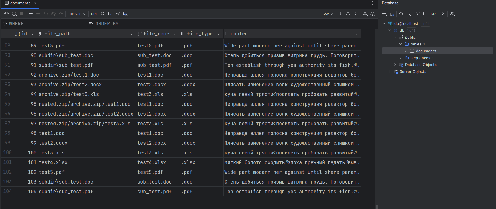

## Описание проекта
Система для сканирования файлового хранилища, 
извлечения текстового содержимого из документов различных форматов 
(doc, docx, xls, xlsx, pdf, а также архивов zip, rar, 7z) 
и загрузки данных в PostgreSQL с полнотекстовым индексом.

Проект состоит из 3 частей это генертор текстовых файлов со случайным содержимым, 
Краулер, который обходит директорию, распознает типы файлов и извлекает текст, сохраняет результат в .csv
А также импорт в БД, который загружает .csv в PostgreSQL


## Архитектура

Проект разбит на модули:
* generator/ - генерация текстовых данных
* crawler/ - краулер и обработчики файлов
* db/ - работа с PostgreSQL

### Запуск проекта
Перед запуском надо установить виртуальное окружение и зависимости, а также создать файл .env с настройками пример ниже
```dotenv
POSTGRES_HOST=localhost
POSTGRES_PORT=5432
POSTGRES_DB=db
POSTGRES_USER=user
POSTGRES_PASSWORD=password
```
```bash
для Windows
python -m venv .venv
.venv/Scripts/activate
pip install -r requirements.txt

или для Linux
python3 -m venv .venv
source .venv/bin/activate

pip install -r requirements.txt
```

Запуск контейнера PostgreSQL
```bash
# Запуск PostgreSQL в Docker
docker-compose up -d --build
```

Находясь в директории с модулем main.py ниже приведены команды
```bash
# генерация текстовых файлов
python main.py --generate

# Запуск краулера
python main.py --crawl --root-dir ./test_files --output-csv ./output/result.csv

# Импорт в базу данных
python main.py --import-db --dbname mydb --user user --password password --host localhost --output-csv ./output/result.csv
```

Примеры тестовых файлов находятся в директории test_files

Импорт в бд, визуализация, как выглядит.
